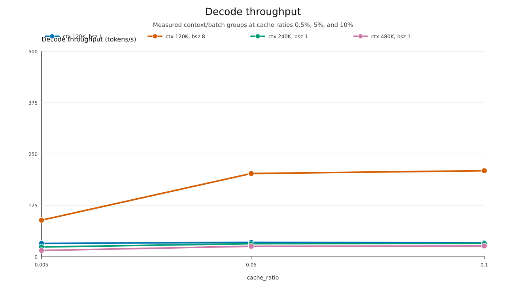
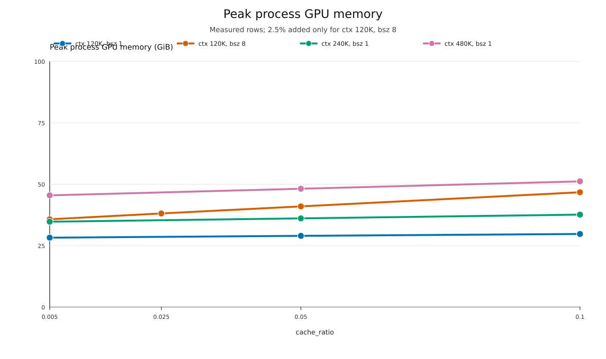
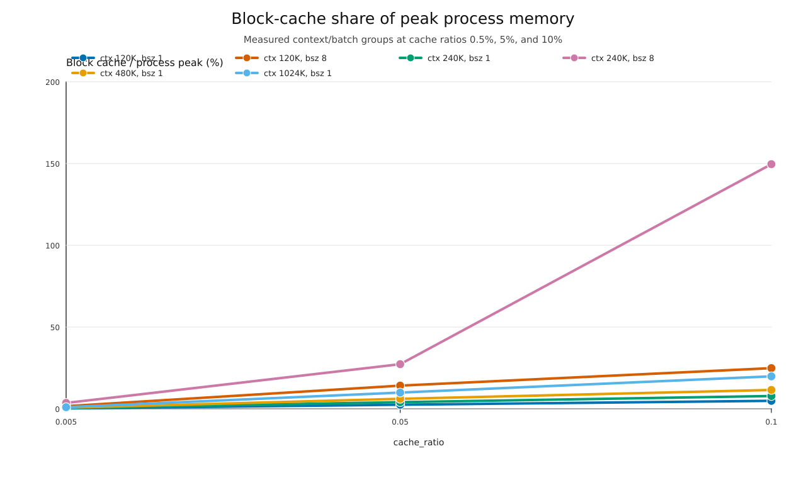

# Cache ratio single-A100

| Context | Batch | Cache ratio | Block cache GiB | Throughput tok/s | Peak GiB |
| --- | --- | --- | --- | --- | --- |
| 120K | 1 | 0.5% | 0.072 | 32.008 | 28.24 |
| 120K | 1 | 5% | 0.727 | 34.617 | 28.99 |
| 120K | 1 | 10% | 1.453 | 33.326 | 29.74 |
| 120K | 8 | 0.5% | 0.578 | 88.702 | 35.73 |
| 120K | 8 | 5% | 5.812 | 202.376 | 40.98 |
| 120K | 8 | 10% | 11.625 | 209.145 | 46.73 |
| 240K | 1 | 0.5% | 0.146 | 23.393 | 34.74 |
| 240K | 1 | 5% | 1.473 | 31.399 | 36.10 |
| 240K | 1 | 10% | 2.945 | 31.902 | 37.62 |
| 480K | 1 | 0.5% | 0.295 | 14.954 | 45.47 |
| 480K | 1 | 5% | 2.949 | 25.125 | 48.16 |
| 480K | 1 | 10% | 5.900 | 25.882 | 51.16 |

