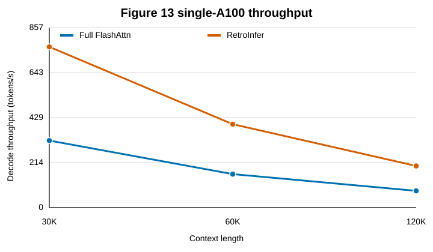
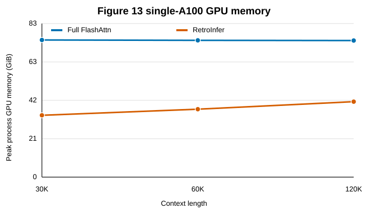

# Figure 13 single-A100

| Context | Full batch | Full tok/s | Full GiB | RetroInfer batch | RetroInfer tok/s | RetroInfer GiB | Speedup |
| --- | --- | --- | --- | --- | --- | --- | --- |
| 30K | 16 | 319.166 | 74.48 | 32 | 765.561 | 33.59 | 2.40 |
| 60K | 8 | 159.416 | 74.29 | 16 | 397.228 | 36.90 | 2.49 |
| 120K | 4 | 79.868 | 74.18 | 8 | 198.265 | 40.98 | 2.48 |

